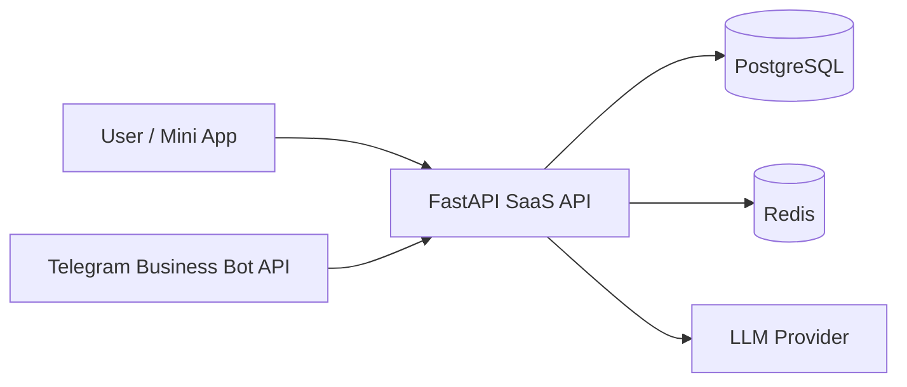
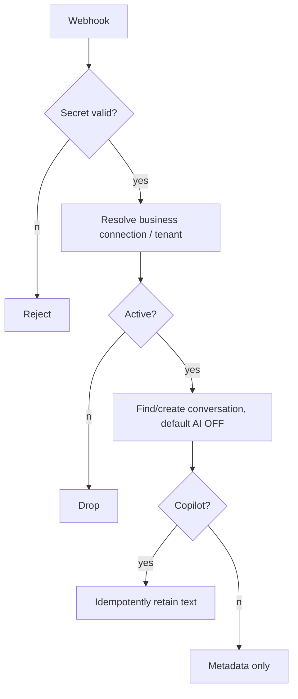
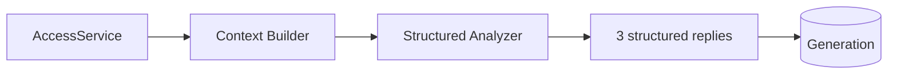
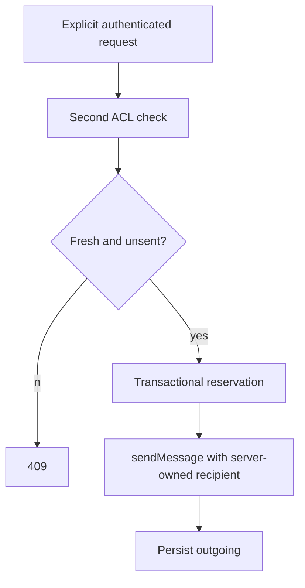

# Architecture
## System context

## Webhook flow

## AI generation flow

## Send flow

## Tenant isolation
Every repository query for user content includes authenticated `user_id`; conversation ID alone is never authoritative. Connection, generation and conversation ownership are jointly checked at the domain boundary.
## Privacy boundary
Telegram recipient restrictions are the first boundary and the application ACL is the second. New conversations are `AI OFF`; text is discarded before persistence while off. LLM context contains semantic text only, never Telegram credentials or authoritative recipient IDs.
